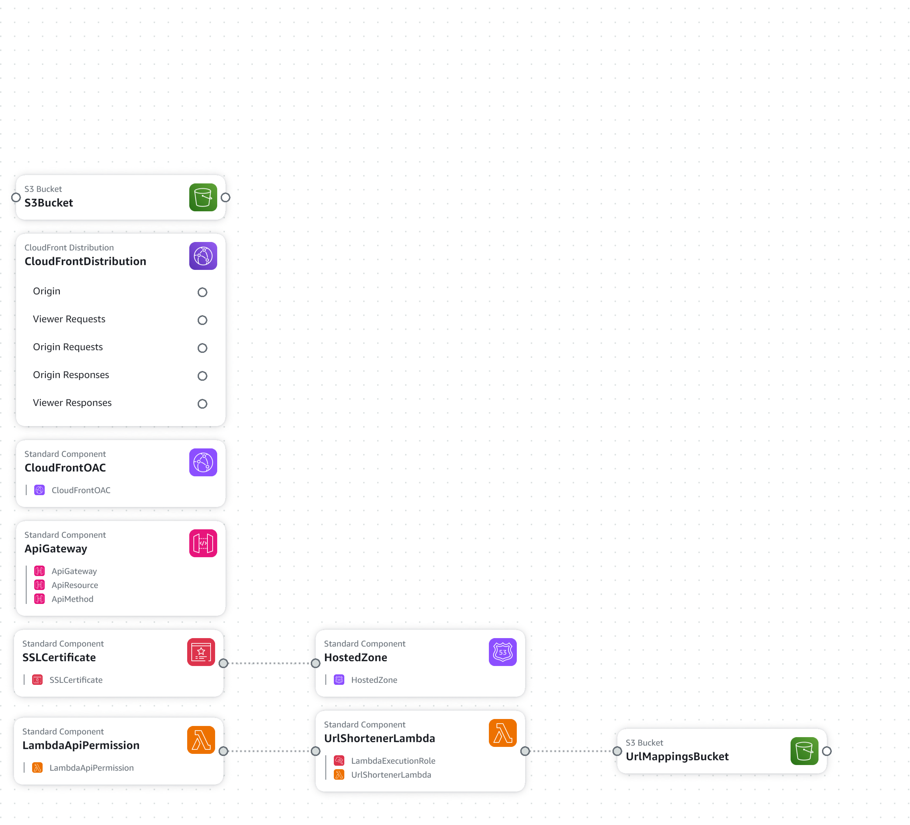

# AWS URL Shrinker

This project sets up a URL shortening service using AWS infrastructure, including S3, CloudFront, Route 53, and Lambda. The architecture follows the diagram provided.

## Architecture Overview

The system comprises the following components:
- **Route 53** for DNS lookups.
- **AWS Certificate Manager** for managing SSL/TLS certificates.
- **CloudFront Distribution** for serving static web content and handling SSL certificates.
- **S3** for storing static web files and the shortened URL mappings.
- **Lambda** for handling the URL shortening logic.
- **API Gateway** to expose the Lambda function as an API for URL shortening.

## Deployment

1. Clone this repository:
   ```bash
   git clone https://github.com/yourusername/AWS-URL-Shrinker.git
   ```

2. Modify the CloudFormation template `url-shrinker-s3-setup.yml` to fit your AWS environment.

3. Deploy the infrastructure using CloudFormation:
   ```bash
   aws cloudformation create-stack --stack-name url-shrinker --template-body file://url-shrinker-s3-setup.yml --parameters ParameterKey=DomainName,ParameterValue=yourdomain.com ParameterKey=HostedZoneName,ParameterValue=yourdomain.com --capabilities CAPABILITY_NAMED_IAM
   ```

4. Push the static web files to the S3 bucket created by the CloudFormation stack.

5. Visit the CloudFront distribution URL to access the URL shrinker service.

## Diagram

Below is the architecture diagram:



## License

This project is licensed under the MIT License - see the [LICENSE](LICENSE) file for details.
    